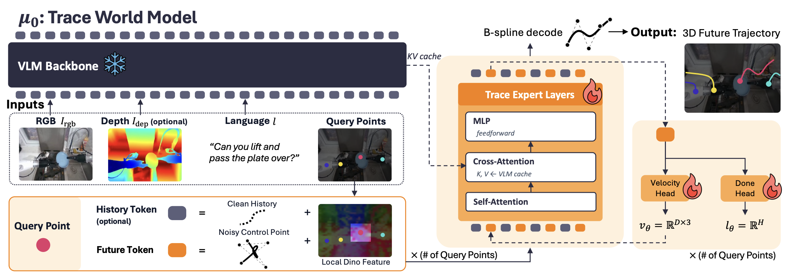
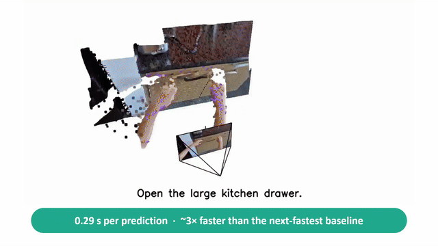

<h1 align="center">μ₀: A Scalable 3D Interaction-Trace World Model</h1>

<p align="center">
  🌐 <a href="https://mu0-wm.github.io">Project Page</a> ·
  📄 <a href="https://arxiv.org/abs/2606.13769">Paper</a> ·
  🤗 <a href="https://huggingface.co/collections/furonghuang-lab/mu0">Models</a>
</p>

<p align="center">
  <a href="https://sjlee.cc/">Seungjae Lee</a><sup>1*</sup>,
  <a href="https://yoonkyojung.com/">Yoonkyo Jung</a><sup>1*</sup>,
  <a href="https://ju-suk.github.io/">Jusuk Lee</a><sup>2</sup>,
  <a href="https://jhshin00.github.io/">Jonghun Shin</a><sup>2</sup>,
  <a href="https://amirshahid.github.io/">Amir Hossein Shahidzadeh</a><sup>1</sup>,<br>
  <a href="https://yaochih.github.io/">Yao-Chih Lee</a><sup>1</sup>,
  <a href="https://scholar.google.co.kr/citations?user=TLQUwIMAAAAJ&hl=en">H. Jin Kim</a><sup>2</sup>,
  <a href="https://jbhuang0604.github.io/">Jia-Bin Huang</a><sup>1†</sup>,
  <a href="https://furong-huang.com/">Furong Huang</a><sup>1†</sup><br>
  <sub><sup>*</sup>Equal contribution &nbsp;&nbsp; <sup>†</sup>Equal advising</sub><br>
  <sub><sup>1</sup>University of Maryland, College Park &nbsp;·&nbsp; <sup>2</sup>Seoul National University</sub>
</p>

<p align="center">
  
</p>

---

**μ₀** is a **trace world model** that operates in **3D space** rather than pixel
or action space. Given an image, a language instruction, and a short history of
keypoints, μ₀ predicts the future **3D traces of semantic interaction points** —
objects, tools, hands, and contact regions — i.e. *what must move* to accomplish
a task. Because these traces are embodiment-agnostic, μ₀ can be **pretrained from
video alone** and transferred across robot embodiments.

<p align="center">
  
</p>

This repository contains the training and evaluation code for μ₀. It is built on
top of 🤗[LeRobot](https://github.com/huggingface/lerobot) — we use its SmolVLA
backbone and dataset/training infrastructure (see
[Acknowledgements](#acknowledgements)).

## Method in one paragraph

μ₀ is 3D trace-based World Model: from
`(image, language, history of N keypoints)` it generates each keypoint's future
trajectory as B-spline control points in an anchor-relative, normalized 3D space
(image-plane `uv` + metric depth). Per-keypoint visual features (DINOv2) and a
metric-depth channel (rendered RGB) condition the prediction, and a per-keypoint
"done" head predicts stopping. At inference, traces are decoded from a single
image — depth and keypoints can be taken from the dataset or synthesized
on-the-fly (Depth-Anything-V2 + Grounded-SAM-2).

## Getting started

- **Training** → [`docs/release/TRAINING.md`](docs/release/TRAINING.md):
  environment setup, the golden single-GPU recipe, and the multi-GPU launch.
- **Evaluation** → [`docs/release/EVALUATION.md`](docs/release/EVALUATION.md):
  batch image-only trace prediction (with metrics) and the interactive GUI.
- **Policy Training & Evaluation** → [`docs/release/TRAINING_POLICY.md`](docs/release/TRAINING_POLICY.md):
  RoboCasa simulation-based mu0 robot policy training and evaluation.

```bash
# Clone this repo, then pull only the submodules you need:
git clone https://github.com/Yoonkyo/mu0 && cd mu0
#   full eval + interactive GUI (Depth-Anything-V2 + Grounded-SAM-2 synthesis):
git submodule update --init infer_helpers/Grounded-SAM-2 infer_helpers/Depth-Anything-V2
#   RoboCasa policy training / evaluation:
git submodule update --init third_party/robosuite third_party/robocasa
```

## Release artifacts

Weights, evaluation data, and normalization stats are not shipped in this repo.
They are hosted on the Hugging Face Hub
([`furonghuang-lab/mu0`](https://huggingface.co/furonghuang-lab/mu0)). Download the whole
release in one command:

```bash
pip install -U "huggingface_hub[hf_transfer]"
hf download furonghuang-lab/mu0 --local-dir mu0_release
cd mu0_release && tar -xf test_set.tar    # only needed for evaluation
```

This gives `final_ckpt/` (released checkpoint), `normalizer_stats.json`
(delta/depth normalization stats used in training and evaluation), and
`test_set.tar` (evaluation episodes; extracts to `test_set/`). You can also grab
individual files via their `resolve` URLs, e.g.
`https://huggingface.co/furonghuang-lab/mu0/resolve/main/final_ckpt/model.safetensors`.

See
[`docs/release/EVALUATION.md`](docs/release/EVALUATION.md) for usage. For
training on your own TraceExtract episodes, see
[`docs/release/TRAINING.md`](docs/release/TRAINING.md) §2.
For training and evaluating downstream control policies on μ₀'s predicted 3D traces, see
[`docs/release/TRAINING_POLICY.md`](docs/release/TRAINING_POLICY.md).


## Citation

```bibtex
@article{lee2026mu0,
  title={$\mu_0$: A Scalable 3D Interaction-Trace World Model},
  author={Lee, Seungjae and Jung, Yoonkyo and Lee, Jusuk and Shin, Jonghun and
          Shahidzadeh, Amir Hossein and Lee, Yao-Chih and Kim, H. Jin and
          Huang, Jia-Bin and Huang, Furong},
  journal={arXiv preprint arXiv:2606.13769},
  year={2026}
}
```

## Acknowledgements

μ₀'s training, dataset, and policy infrastructure are built on
**[LeRobot](https://github.com/huggingface/lerobot)** (Apache-2.0) by Hugging
Face — in particular the **SmolVLA** policy and the LeRobot dataset/training
stack. We thank the LeRobot team and contributors. The upstream license is
retained in [`LICENSE`](LICENSE). If you use this code, please also cite LeRobot.
